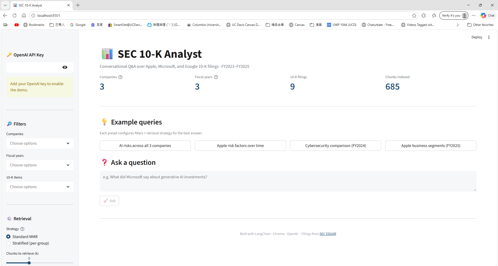
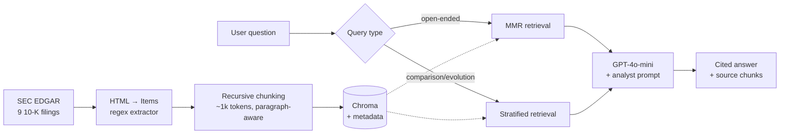
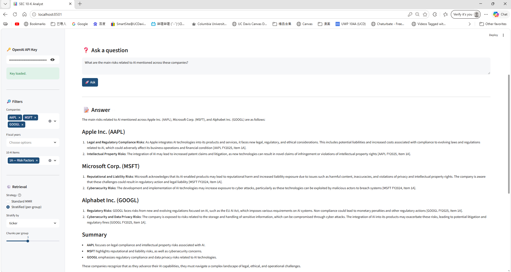

# 📊 SEC 10-K Analyst

> Conversational Q&A over SEC 10-K filings with structure-aware retrieval and cited answers.

[](https://sec-rag-analyst.streamlit.app)
[](https://www.python.org/)

A production-grade RAG pipeline over SEC 10-K filings for **Apple, Microsoft, and Alphabet** (FY2023–FY2025). Built with LangChain, Chroma, and OpenAI. Every answer is grounded in specific 10-K sections and cited inline.



🔗 **Live demo:** [sec-rag-analyst.streamlit.app](https://sec-rag-analyst.streamlit.app)
📂 **9 filings indexed · 685 chunks · 11 SEC Items · ~$0.01 to (re-)build the index**

---

## What makes this interesting

Most public RAG demos break in two predictable ways. This one doesn't, because both failure modes were diagnosed during development and engineered around. The two patterns combined — **metadata filters + stratified retrieval** — are the production approach for hybrid retrieval over structured corpora.

### Failure mode 1: constraint violation

When a user asks *"Compare cybersecurity disclosures of MSFT, AAPL, and Google in FY2024"*, pure semantic retrieval (MMR) returns chunks that are *semantically similar* but *constraint-violating* — e.g., it returns MSFT FY2025 because the wording is closer to the query than FY2024.

**Fix:** Chroma metadata filters. Every chunk is tagged at ingestion with `ticker`, `fiscal_year`, `item`, `item_title`. Explicit constraints in the question are enforced as filters *before* semantic ranking.

### Failure mode 2: stratification failure

When a user asks *"How did Apple's risk factors evolve from FY2023 to FY2025?"*, MMR with a `ticker=AAPL, item=1A` filter still cluster on whichever year's phrasing happens to be most semantically distinct. The model then makes claims about "FY2023" without ever seeing FY2023 chunks — silent hallucination through inference.

**Fix:** stratified retrieval. For cross-group queries, the retriever runs *one MMR call per group* (per year, per ticker, etc.) and merges. This guarantees coverage instead of hoping for it.

### Anti-hallucination by design

The system prompt requires inline citations in `[TICKER FYxxxx, Item X]` format and explicitly instructs the model to refuse when context doesn't contain the answer. Combined with `temperature=0` and metadata-tagged chunks, the model can reliably attribute every claim — and visibly *abstains* when asked questions outside the corpus.

---

## Architecture



### Pipeline stages

| Stage | What | Why |
|---|---|---|
| **Ingest** | Pulls 10-Ks directly from EDGAR via the SEC's submissions API; uses `report_date` (not `filing_date`) to define fiscal year | Filers have different fiscal-year ends (MSFT = June, AAPL = Sept, GOOGL = Dec). Filtering by report period gets analyst-correct results. |
| **Parse** | `BeautifulSoup` → text → regex extractor for SEC Item boundaries with last-occurrence heuristic | Robust to the table-of-contents duplication and HTML inconsistency across filers. |
| **Chunk** | `RecursiveCharacterTextSplitter` within each Item; ~4000 chars / 400 overlap; tagged with `ticker`, `fiscal_year`, `item`, `item_title`, `source`, `chunk_index` | Chunk boundaries respect paragraphs > sentences > words. Metadata is what makes filtered + stratified retrieval possible. |
| **Embed** | `text-embedding-3-small` → Chroma persistent collection on disk | ~$0.01 to embed full corpus. Chroma is local SQLite — zero infra for deployment. |
| **Retrieve** | MMR with optional Chroma filters; stratified-per-group for comparison queries | Two retrieval modes for two distinct failure patterns (see above). |
| **Generate** | `gpt-4o-mini`, `temperature=0`, financial-analyst system prompt with citation requirements | Deterministic, anti-hallucinating, cited. |

---

## Demo queries

Each preset in the UI configures filters + retrieval strategy automatically.

| Query | Strategy | Filter |
|---|---|---|
| AI risks across all 3 companies | Stratified by `ticker` | `item=1A` |
| Apple risk factors over time | Stratified by `fiscal_year` | `ticker=AAPL, item=1A` |
| Cybersecurity comparison FY2024 | Stratified by `ticker` | `item=1C, fiscal_year=2024` |
| Apple business segments FY2025 | Standard MMR | `ticker=AAPL, fiscal_year=2025, item=1` |



---

## Setup (run locally)

```bash
git clone https://github.com/siqichen99-droid/sec-rag-analyst.git
cd sec-rag-analyst

python -m venv .venv
# Windows:
.venv\Scripts\Activate.ps1
# Mac/Linux:
source .venv/bin/activate

pip install -r requirements.txt

cp .env.example .env
# Edit .env and add:
#   OPENAI_API_KEY=sk-proj-...
#   SEC_USER_AGENT=Your Name your.email@example.com

# (Optional — only needed if you want to rebuild the index from scratch)
python -m src.ingest      # downloads 9 10-Ks from EDGAR (~30s)
python -m src.embed       # embeds + indexes (~1min, costs ~$0.01)

# Run the app
streamlit run app.py
```

The Chroma index ships with the repo, so the embed step is optional unless you want to extend the corpus.

---

## Limitations & future work

Documenting limitations honestly because the failure modes themselves are part of the engineering story.

- **Item-boundary parser is regex-based.** Works perfectly for 8 of 9 filings; for MSFT FY2025, the "last occurrence" heuristic misattributes Item 7 content to Item 7A because Item 8 references "as discussed in Item 7A" later in the document. A v2 would parse iXBRL semantic structure (`<ix:nonNumeric>` tags already present in the source) instead of post-rendered text.
- **No automatic query → filter parsing.** The Streamlit UI exposes filters as multi-selects; the `ask()` API requires explicit filter dicts. A v2 could use a small LLM call to extract entities (years, tickers, sections) from the natural-language question and apply them automatically.
- **Corpus-scoped to 3 companies × 3 years.** This is a config change in `src/ingest.py`; the rest of the pipeline is corpus-agnostic. Scaling to S&P 500 would cost ~$5–10 in embeddings and ~30 minutes of ingestion.
- **No reranker.** A cross-encoder reranker (e.g., `bge-reranker-base`) on the top-20 retrieved chunks would likely improve precision. Skipped for cost/latency on the live demo.

---

## Tech stack

- **LangChain 0.3** — RAG composition, retriever interface
- **Chroma 0.5** — vector store (local SQLite, no infra)
- **OpenAI** — `text-embedding-3-small` for embeddings, `gpt-4o-mini` for generation
- **Streamlit 1.40** — UI + Streamlit Cloud deployment
- **BeautifulSoup4 + lxml** — HTML parsing
- **SEC EDGAR** — public 10-K source

---

## Repository structure

```
sec-rag-analyst/
├── src/
│   ├── ingest.py        # EDGAR pull → data/
│   ├── parse.py         # HTML → SEC Item text
│   ├── chunk.py         # text → metadata-tagged Documents
│   ├── embed.py         # → Chroma index
│   └── rag.py           # ask() and stratified_ask()
├── app.py               # Streamlit UI
├── chroma_db/           # persisted vector index (committed)
├── data/                # raw 10-K HTML (gitignored — re-fetchable)
├── docs/                # screenshots
├── .streamlit/
│   └── config.toml      # theme
├── requirements.txt
└── README.md
```

---

Built by **Siqi Chen** · Filings sourced from [SEC EDGAR](https://www.sec.gov/edgar)